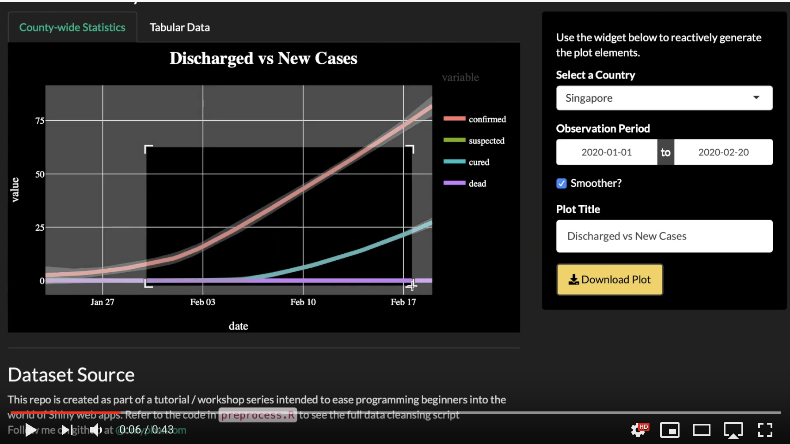

# COVID 19 (2019-nCoV) Web Dashboard
This repo is created as part of a tutorial / workshop series intended to ease programming beginners into the world of Shiny web apps.

The lecture is divided into 4 parts and its intended audience are absolute beginners in Shiny and web development in general. 

## Preview
A preview of the app we're building:

To keep the focus on the mechanics of Shiny, all of the data provided in this repo has been cleaned. Rather than spending 2 hours cleaning and reshaping data, you can invest that 2 hours into learning the features of Shiny.

## Learn more about Shiny
1. Fork the [DarkerShiny](https://github.com/onlyphantom/darkershiny) template and work your data into the darker template
2. Attend a workshop on this topic (_more details coming soon_)
3. [Cheatsheet](https://shiny.rstudio.com/images/shiny-cheatsheet.pdf) from RStudio

## Dataset Source
1. [canghailan/Wuhan-2019-nCoV](https://github.com/canghailan/Wuhan-2019-nCoV)
2. [Novel Coronavirus (COVID-19) Cases, provided by JHU CSSE](https://github.com/CSSEGISandData/COVID-19)

To use real-time data on the Corona virus epidemic, read from the end points below:
- csv: https://raw.githubusercontent.com/canghailan/Wuhan-2019-nCoV/master/Wuhan-2019-nCoV.csv
- json: https://raw.githubusercontent.com/canghailan/Wuhan-2019-nCoV/master/Wuhan-2019-nCoV.json